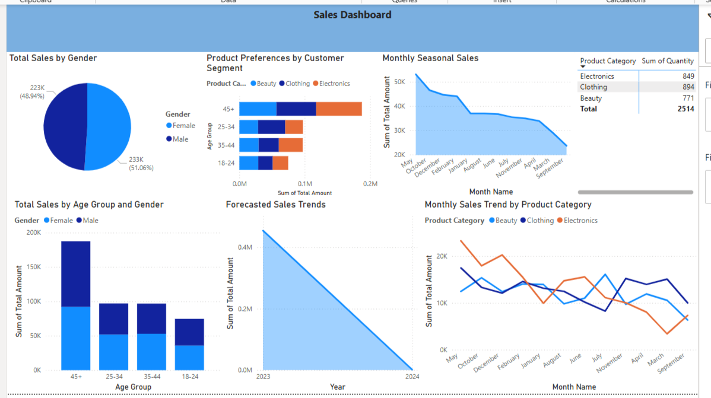

# 📊 Power BI Sales Dashboard Project

This project presents a Power BI dashboard analyzing retail sales data. It highlights trends across gender, age groups, product categories, and monthly patterns.

## 🔍 Features

- Monthly sales trends and seasonal analysis
- Customer segmentation by age and gender
- Product category performance
- Forecasted yearly sales trends

## 📸 Dashboard Preview

> *Note: Visualization preview is based on a static screenshot. To explore the live dashboard, download the `.pbix` file or access via Power BI Service.*

## 📁 Project Files

- `Yasmeen.pbix` – The full Power BI dashboard file
- `Dashboard.png` – Screenshot of the visual dashboard

## 🛠 Tools Used

- Microsoft Power BI Desktop
- Data Modeling
- DAX for calculated measures
- Power BI Service (optional: for online publishing)

---

Feel free to explore, download, and share feedback!
